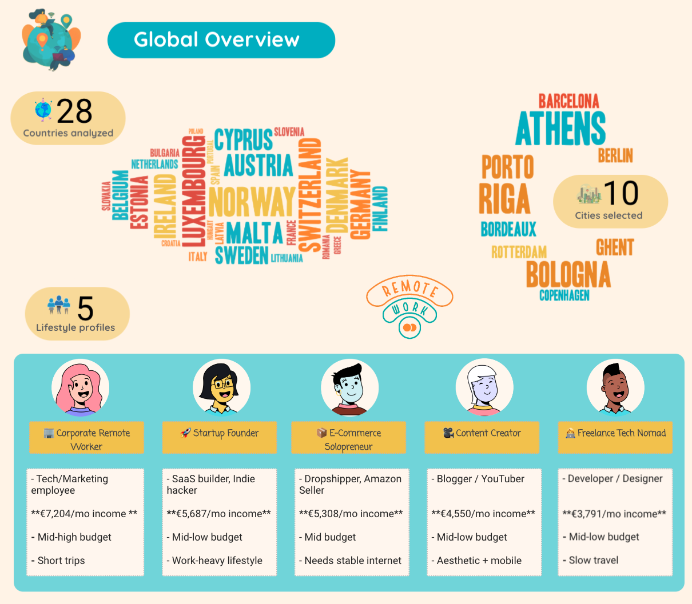
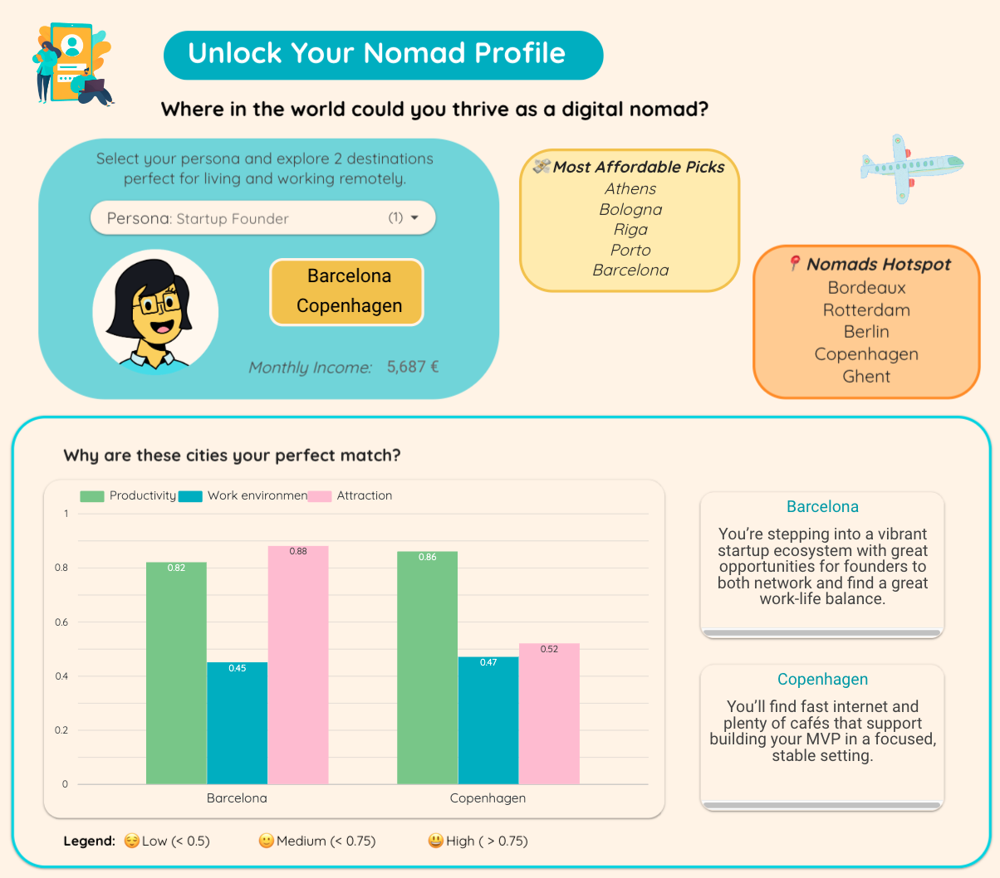

# Sales Ops & Enablement Portfolio

Welcome to my portfolio! This repository highlights my work at the intersection of **Sales Operations, Enablement, and Data Analytics**.  
I combine hands-on technical skills with process design to drive productivity, adoption, and revenue growth.  

---

## 📊 Dashboards

- [Looker Studio: Digital Nomad Affordability](https://lookerstudio.google.com/reporting/4238564b-ce46-4723-ac4e-917c7cac0c8f)  
  *Built to compare affordability, digital infrastructure, and productivity across 28 European countries.*

- 🎥 [Watch my presentation on YouTube](https://www.youtube.com/watch?v=-fqlwPO4IiY)
  
### 🌍 Global Overview  
  
  
### 💶 Cost & Affordability 

### 🏙️ Nomad Match Example  

  
📂 Additional screenshots included in the [`dashboards/`](dashboards/) folder. 

---

## 📈 Analytics & Data
> ⚡ Note: Several of the SQL and Python examples were originally written as part of my Le Wagon Data Analytics bootcamp.  
> I’ve reformatted and documented them here to highlight business relevance as Sales Ops.

- **SQL Queries**
  - [`pipeline_stage_distribution.sql`](analytics/sql/pipeline_stage_distribution.sql) → Count deals by stage to assess pipeline health, spot bottlenecks, and highlight CRM hygiene issues.  
  - [`revenue_by_category.sql`](analytics/sql/revenue_by_category.sql) → Analyze top categories by revenue & margin, then deep-dive into repeat behavior and product breadth.  
  - [`margin_segmentation.sql`](analytics/sql/margin_segmentation.sql) → Classify deals/products into High/Medium/Low margin tiers to guide sales focus and discounting strategy.

- **Python Notebooks**:
  - [`sales_kpi_modeling.ipynb`](analytics/python/sales_kpi_modeling.ipynb) → exploratory analysis and sales KPI modeling.  
---

## 🚀 Enablement Frameworks  

- [`onboarding-checklist.md`](enablement/onboarding-checklist.md) → 3-week blended onboarding path with a week-by-week checklist for CRM training, roleplays, shadowing, and certification. Reduced ramp time from 6 months → 3 months.  
- [`competency-framework.md`](enablement/competency-framework.md) → Defines expectations for sales reps across product knowledge, sales process, customer engagement, and collaboration, with clear levels from New Hire to Expert.  
- [`call-evaluation-scorecard.md`](enablement/call-evaluation-scorecard.md) → Coaching tool to evaluate sales calls across opening, discovery, value, objections, and closing, with a structured 1–4 scoring scale and coaching notes.  

---

## 📚 Case Studies
- [Boosting Sales Productivity from 40% → 85%](case-studies/sales-productivity-boost.md)  
- [Improving CRM Data Hygiene](case-studies/pipeline-hygiene-improvement.md)  

---

## 🛠 Project Management
For a detailed breakdown of how I scoped, planned, and delivered these projects, see my full [Notion Project Page](link-to-notion).  

---

## 👩‍💻 About Me
I began my career in SaaS sales and transitioned into Sales Enablement, scaling onboarding and GTM programs across 5 markets and 190 reps. Most recently, I’ve been upskilling in SQL, Python, dbt, and Looker Studio to strengthen the data side of Sales Ops.  

---
